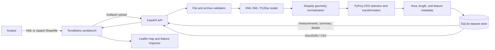
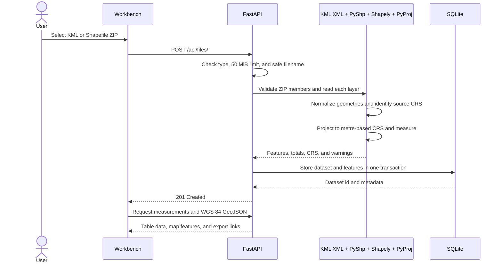
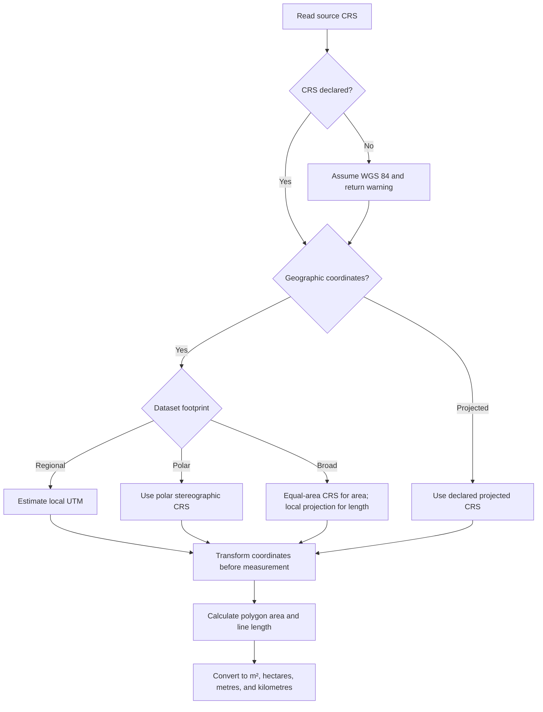
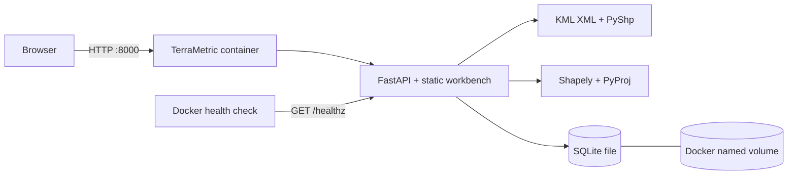

# TerraMetric

**A geospatial measurement workspace for KML and Shapefiles.** Upload a survey, inspect every feature on a map, and get area and distance measurements in real-world units. TerraMetric projects geographic coordinates before measuring, keeps a searchable local history, and exports clean WGS 84 GeoJSON or analysis-ready CSV.

## Demo

Run the app locally, open [http://127.0.0.1:8000](http://127.0.0.1:8000), then choose **Try demo**. The bundled Northstar Reserve survey contains three parcels, two paths, and one field station. It demonstrates polygon area, line length, point handling, map styling, feature inspection, and downloads without needing a data file.

## Features

- KML and ZIP uploads containing one or more Shapefile layers
- Interactive Leaflet map, fit-to-data view, geometry styling, and feature popups
- Projected polygon area in m² and hectares; line length in m and km
- Source CRS, measurement CRS, and missing or unsupported geometry warnings
- Workspace-wide totals and per-dataset geometry summaries
- Searchable, geometry-filterable, paginated feature table
- Click any feature for its complete attributes and measurement details
- GeoJSON export transformed to WGS 84, plus CSV measurement export
- Built-in demo survey, recent dataset history, and dataset deletion
- FastAPI OpenAPI page, SQLite persistence, Docker image, and Compose setup
- Upload and archive limits, ZIP path validation, geometry repair, and transactional writes

## Run locally

Python 3.11+ is recommended. KML is parsed with Python's XML library; Shapefiles are read with PyShp, so the local setup does not require a system GDAL installation.

```bash
python -m venv .venv
source .venv/bin/activate       # Windows: .venv\\Scripts\\activate
pip install -r requirements.txt
uvicorn app.main:app --reload
```

Open the workbench at [http://127.0.0.1:8000](http://127.0.0.1:8000), API docs at [http://127.0.0.1:8000/docs](http://127.0.0.1:8000/docs), and health check at [http://127.0.0.1:8000/healthz](http://127.0.0.1:8000/healthz). SQLite data is stored in `data/terrametric.sqlite3`; set `TERRAMETRIC_DATA_DIR` to change the location. Set `TERRAMETRIC_CORS_ORIGINS` to a comma-separated allowlist only when serving the API from a separate frontend origin.

### Docker

```bash
docker compose up --build
```

Compose publishes port `8000`, persists the SQLite database in a named volume, and includes a container health check. To stop the app, run `docker compose down`; the volume remains unless explicitly removed.

## API

All request and response bodies use JSON except multipart uploads and CSV downloads. Interactive OpenAPI docs are available at `/docs`.

### Workspace and demo

| Method | Endpoint | Description |
|---|---|---|
| `GET` | `/healthz` | Liveness check |
| `GET` | `/api/summary/` | Workspace totals across all stored datasets |
| `GET` | `/api/files/?limit=20` | Recent uploads; `limit` is 1–100 |
| `POST` | `/api/demo/` | Process and save the bundled Northstar Reserve sample |

### Upload and dataset

| Method | Endpoint | Description |
|---|---|---|
| `POST` | `/api/files/` | Upload a `.kml` file or `.zip` Shapefile archive (`file` multipart field) |
| `GET` | `/api/files/{id}/` | Dataset metadata, CRS, status, warnings, and geometry counts |
| `DELETE` | `/api/files/{id}/` | Permanently delete the dataset and its processed features |

Example upload:

```bash
curl -F 'file=@survey.kml' http://127.0.0.1:8000/api/files/
```

Shapefile ZIPs should contain `.shp`, `.shx`, and `.dbf`; a `.prj` is strongly recommended. A successful upload returns `201 Created` and a dataset record with measurement and GeoJSON links. Unsupported or malformed input returns a clear `4xx` response.

### Feature measurements and exports

| Method | Endpoint | Description |
|---|---|---|
| `GET` | `/api/files/{id}/measurements/` | Paginated feature details and filtered aggregate totals |
| `GET` | `/api/files/{id}/features/{feature_id}/` | Full details for one feature |
| `GET` | `/api/files/{id}/geojson/` | WGS 84 GeoJSON FeatureCollection |
| `GET` | `/api/files/{id}/geojson/?download=true` | Download GeoJSON as an attachment |
| `GET` | `/api/files/{id}/measurements.csv` | Download per-feature measurements and properties as CSV |

Measurements accepts `page` (default `1`), `page_size` (default `100`, maximum `500`), `geometry_type`, and `search` (matches feature properties). Every feature includes its id, layer, geometry type, source CRS, geometry, properties, and measurement. Unsupported types and points return `measurement: null` plus a note instead of failing the dataset.

Example response shape:

```json
{
  "pagination": {"page": 1, "page_size": 100, "total": 6, "pages": 1},
  "totals": {
    "area_m2": 12345.0, "area_hectares": 1.2345,
    "length_m": 678.0, "length_km": 0.678,
    "area_features": 3, "length_features": 2, "unmeasured_features": 1
  },
  "features": [
    {
      "id": 1, "layer": "KML", "geometry_type": "Polygon", "crs": "EPSG:4326",
      "properties": {"Name": "North Meadow"},
      "measurement": {"kind": "area", "value": 12345.0, "unit": "m²", "hectares": 1.2345},
      "measurement_note": null
    }
  ]
}
```

## Architecture

The browser is a lightweight static workbench. FastAPI validates requests and coordinates processing. The built-in KML reader and PyShp read source features, Shapely repairs and measures geometry, PyProj selects and applies projections, and SQLite stores processed records. Original uploads are not retained.



### Processing flow



### CRS and measurement flow



### Deployment layout



## CRS and measurement decisions

Coordinates are never measured directly in longitude/latitude degrees. The source CRS is read from the file; KML normally declares EPSG:4326. Geographic datasets use a regional UTM projection, a polar stereographic projection at high latitudes, or an equal-area projection for broad area calculations. Length uses a local projection. Projected source units are converted to metres. If a CRS is missing, coordinates are assumed to be WGS 84 and a warning is returned; verify this assumption for unlabeled data.

Measurements use planar Shapely operations after PyProj transforms the geometry. This is accurate for ordinary regional survey footprints and avoids the complexity of ellipsoidal geodesics. Very large line datasets crossing projection zones should be split by region for best distance accuracy. GeoJSON exports transform geometries to WGS 84 as required by common GeoJSON clients.

## Limits and safety

- Upload limit: 50 MiB; uncompressed archive limit: 250 MiB
- ZIP limit: 500 members and 20 Shapefile layers
- Feature limit: 100,000 per upload
- Archive paths are validated; files are materialized only in a temporary directory
- Geometry repair is attempted per feature; unsupported geometries are retained with no measurement
- SQLite writes are transactional; failed processing does not leave a partial dataset
- `DELETE` removes a dataset and its features permanently

## Project layout

```text
app/
  main.py             FastAPI routes, API docs, static hosting
  processor.py        KML/Shapefile reading, validation, CRS, measurements
  store.py            Transactional SQLite persistence and summaries
  static/
    index.html        Workbench structure
    styles.css        Visual system and responsive layout
    enhancements.css Dialog, export, and workspace summary styles
    app.js            Upload, map, filtering, exports, and dataset actions
examples/
  reserve-survey.kml  Built-in six-feature demo survey
Dockerfile
compose.yaml
requirements.txt
```

## What I learned

Reliable geospatial measurement depends as much on coordinate reference systems and units as on the geometry operation. KML and Shapefile layers can also differ in how they declare CRS and attributes, so careful validation, explicit assumptions, and feature-level warnings are central to a trustworthy workflow.

## Future scope

- Background processing and progress events for very large datasets
- PostGIS storage, user accounts, and team workspaces
- GeoPackage and GeoJSON input, plus richer export filters
- Projection selection for datasets spanning multiple UTM zones
- Deployment authentication, rate limiting, and configurable retention
- Optional geodesic measurements and precision metadata

## License

MIT. See [LICENSE](LICENSE).
